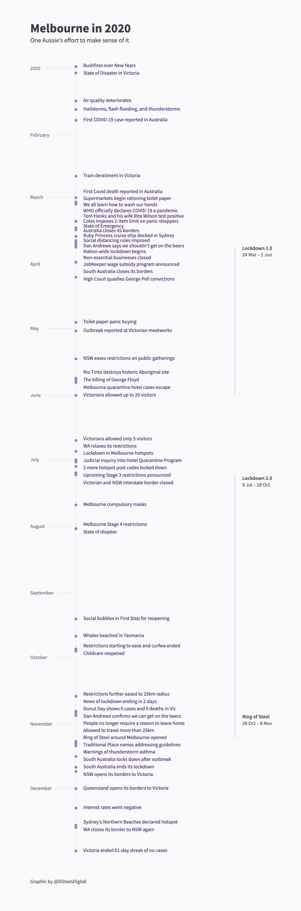

# 2020 Timeline

Melbourne in 2020. One Aussie’s effort to make sense of it.

This project uses [D3](https://d3js.org/) and vanilla JavaScript.

## Development

- `npx live-server src` to run live-server for hot reloading in local development

## License

The code is licensed under MIT License, as shown in [LICENSE.md](./LICENSE.md).

## Author

[Di](https://didoesdigital.com)

## Screenshot

